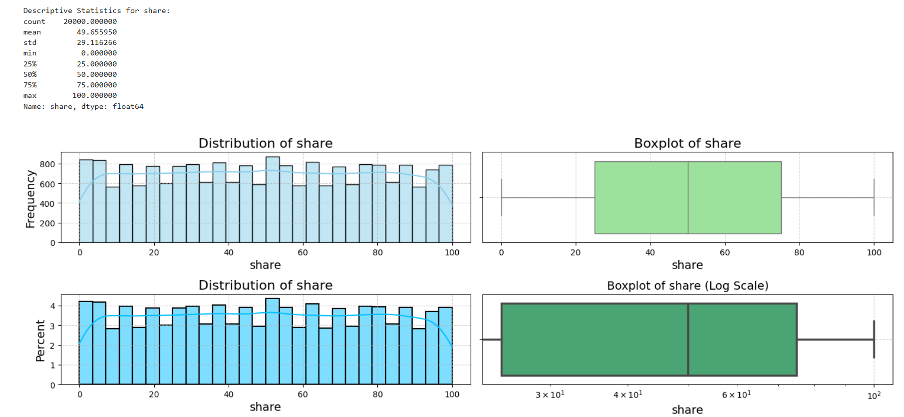

# DA Assignment 1

## Task Assignment

## Exploratory data analysis and data cleaning

### General data preprocessing

The following steps were preformed in order to investigate general data quality, 
structure and omit fully empty or duplicated rows from analysis.

#### Defined proper feature types:

Files loaded with provided `./data/bronze/group_data.csv` and `./data/bronze/posts_data.csv` were loaded with 
schemas defined below correspondingly.
```python
group_df_schema = {
    "post_id" : int,
    "group_name" : str
}

posts_df_schema = {
    "post_id" : int,
    "post_date" : object,  # parse_dates=["post_date"], date_format="%Y-%m-%d"
    "post_type" : str,
    "reach" : int,
    "click" : int,
    "likes" : float,
    "comments" : int,
    "share" : int,
    "reaction" : int
}
```

#### Removed empty rows and duplicated data:

No entirely empty or duplicated rows were found in both datasets.

#### Defined relation between two entities provided:

Column `post_id` is unique per row for each dataset and can be treated as PK for each table. 
Moreover, relation between two entities is one-to-one, therefore two datasets were joined on `post_id` into one
for further analysis.

#### Investigated number of empty values for each features:

Missing values were found only for feature `likes` (37 missing out of 20'000 total). 
After feature analysis they would be populated with proper values.

No other types of values that could be considered as "missing" we found, i.e. empty strings in 
categorical features, negative values, etc.

### Feature analysis

This section was dedicated to analyse features distribution, outliers presence, correlations.

#### Categorical features analysis:

There are only two categorical features for dataset: `post_type` and `group_name`. 
Each of them contains approximately same number of rows.


#### Numerical features analysis:

For numerical features following results were obtained.
- `reach`: no values missing, no negative values, logarithmic distribution, big number of outliers with high values.
- `click`: no values missing, no negative values, logarithmic distribution, big number of outliers with high values.
- `likes`: 37 values missing, no negative values, logarithmic distribution, bit number of outliers with high values.
- `comments`: no values missing, rows count for each comments number is the almost same, no outliers.
- `share`: no values missing, rows count for each share number is the almost same, no outliers.
- `reaction`: no values missing, rows count for each reaction number is the almost same, no outliers.

Graphics with statistics and distribution for each numerical features are provided below.





#### Numerical features correlations:

Pearson and Spearman correlation matrices, from which it could be seen that 
for `reach ~ likes` and `reach ~ clicks` exists a strong linear relationship.


By building pairwise scatter plots for features, we can conclude the following:
- Relationships `reach ~ likes` and `reach ~ clicks` are formed from multiple straight lines, which obvi
- we
- 

#### Numerical features analysis within groups:

### Empty values handling

#### Empty values populating

### Outliers investigation

#### Features containing outliers:

#### Dependency between outliers investigation:


- `EDA_and_Data_Preprocessing.ipynb`

## Feature Engineering and correlations investigation:
- `Feature_Engineering_and_Reccomendations.ipynb`

## Predictive analysis:
- `Reach_and_Likes_Prediction.ipynb`
