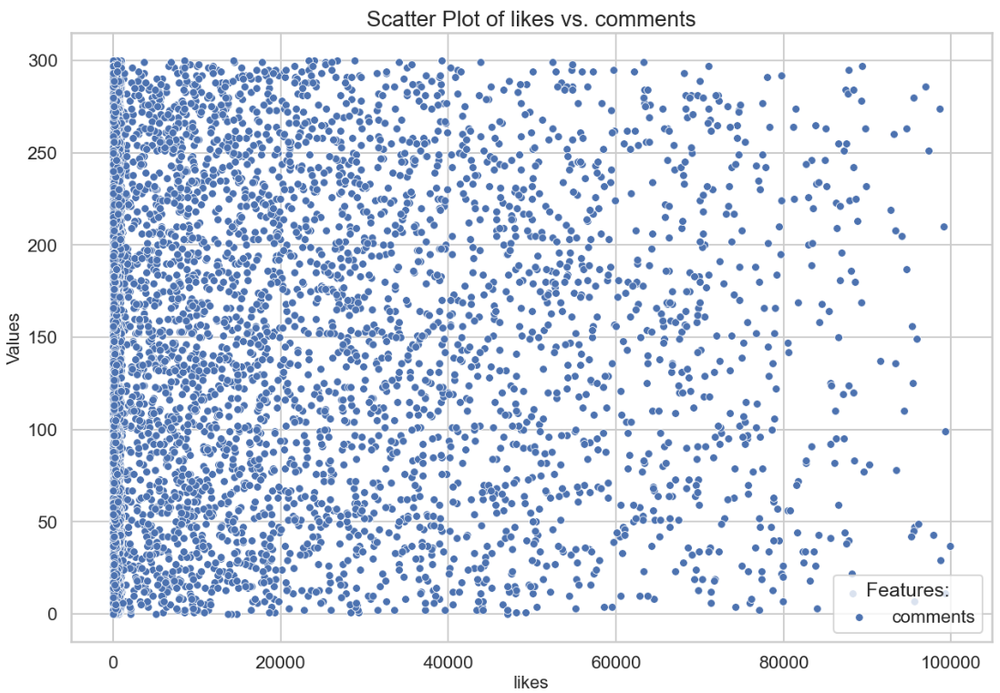
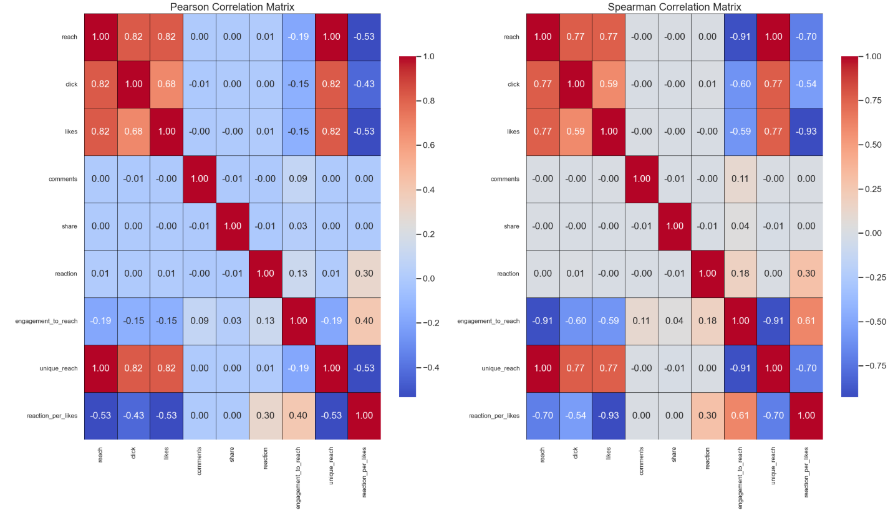

# DA Assignment 1

## Task Assignment

### Data
The provided CSV files contain approximately 20,000 rows with the following fields:
- **Post Statistics**
  - `post_id`: Unique post identifier.
  - `post_date`: Date and time of publication.
  - `post_type`: Type of post (article, short note, promo, etc.).
  - `reach`: Post reach.
  - `click`: Number of clicks.
  - `likes`: Number of likes.
  - `comments`: Number of comments.
  - `share`: Number of shares.
  - `reaction`: Total reaction score (e.g., "love", "haha", "angry", excluding likes).
- **Posts by Groups**
  - `group_name`: Name of the group or category the post belongs to.
  - `post_id`: Unique post identifier.

### Objectives
1. **Data Cleaning**
   - Identify and handle missing values and anomalies (e.g., negative reach, invalid dates).
   - Justify the chosen methods for handling these issues.
2. **Anomaly Detection**
   - Detect and visualize outliers in key metrics (reach, likes, comments, etc.).
   - Explain why these values are considered outliers and how to address them.
3. **Metric Development**
   - Create at least three additional metrics from the existing data.
   - Explain the importance/relevance of these new metrics.
   - Explore correlations between existing and new metrics using visual tools (correlation matrix, scatter plots).
   - Interpret the results, highlighting strong or weak correlations.
4. **Forecasting**
   - Predict next month's clicks and reach using simple to advanced models (Moving Average, Linear Regression, ARIMA, Prophet).
   - Explain the rationale behind the chosen forecasting method and evaluate its accuracy.
5. **Insights and Recommendations**
   - Identify at least two insights from the analysis.
   - For each insight:
     - Explain how it can help achieve key project goals (increase overall reach, user reactions per post, total shares).
     - Provide actionable recommendations for the project team.
     - Estimate potential changes in target metrics under different implementation scenarios (100%, 50%, 25%).
     - Support each insight with visualizations and brief statistics.

### Deliverables
Provide graphical and textual responses to address the objectives outlined above.

## Exploratory data analysis and data cleaning

### General data preprocessing

The following steps were preformed in order to investigate general data quality, 
structure and omit fully empty or duplicated rows from analysis.

#### Defined proper feature types:

Files loaded with provided `./data/bronze/group_data.csv` and `./data/bronze/posts_data.csv` were loaded with 
schemas defined below correspondingly.
```python
group_df_schema = {
    "post_id" : int,
    "group_name" : str
}

posts_df_schema = {
    "post_id" : int,
    "post_date" : object,  # parse_dates=["post_date"], date_format="%Y-%m-%d"
    "post_type" : str,
    "reach" : int,
    "click" : int,
    "likes" : float,
    "comments" : int,
    "share" : int,
    "reaction" : int
}
```

#### Removed empty rows and duplicated data:

No entirely empty or duplicated rows were found in both datasets.

#### Defined relation between two entities provided:

Column `post_id` is unique per row for each dataset and can be treated as PK for each table. 
Moreover, relation between two entities is one-to-one, therefore two datasets were joined on `post_id` into one
for further analysis.

#### Investigated number of empty values for each features:

Missing values were found only for feature `likes` (37 missing out of 20'000 total). 
After feature analysis they would be populated with proper values.

No other types of values that could be considered as "missing" we found, i.e. empty strings in 
categorical features, negative values, etc.

### Feature analysis

This section was dedicated to analyse features distribution, outliers presence, correlations.

#### Categorical features analysis:

There are only two categorical features for dataset: `post_type` and `group_name`. 
Each of them contains approximately same number of rows.


#### Numerical features analysis:

For numerical features following results were obtained.
- `reach`: no values missing, no negative values, logarithmic distribution, big number of outliers with high values.
- `click`: no values missing, no negative values, logarithmic distribution, big number of outliers with high values.
- `likes`: 37 values missing, no negative values, logarithmic distribution, bit number of outliers with high values.
- `comments`: no values missing, rows count for each comments number is the almost same, no outliers.
- `share`: no values missing, rows count for each share number is the almost same, no outliers.
- `reaction`: no values missing, rows count for each reaction number is the almost same, no outliers.

Graphics with statistics and distribution for each numerical features are provided below.


#### Numerical features correlations:

Pearson and Spearman correlation matrices, from which it could be seen that 
for `reach ~ likes` and `reach ~ clicks` exists a strong linear relationship.


By building pairwise scatter plots for features, we can conclude the following:
- Relationships `reach ~ likes` and `reach ~ clicks` are formed from multiple straight lines. Data obviously was generated,
  and these dependencies further will be used to populate missing values and prediction analysis.
- No other relations make sense in terms of prediction / trend / correlation value: data is distributed evenly. 





#### Numerical features analysis within groups:

- Within groups `post_type` and `group_name` all numerical features are distributed in the same way. 
- General statistic parameters within groups is equal.
- No conclusions regarding distinct behaviour of numerical features within group could be made.

### Empty values handling

#### Empty values populating:

Taking in consideration specific linear correlation (multiple lines in fact) `likes ~ reach`, 
the most reasonable approach of handling those empty values can be linear regression. 

In this case, missing `likes` would be on the "line in the middle".


### Outliers investigation

#### Features containing outliers:

From numerical feature analysis we can conclude, that outliers and any possible anomalies are in features 
`reach`, `likes` and `click`. Now we will take a look at total number and data of outliers per each feature.

```csv
Number of outliers in 'reach': 3967
Outliers statistics:
count      3967.000000
mean     514307.745652
std      282995.188409
min       20937.000000
25%      268513.500000
50%      516023.000000
75%      763542.500000
max      999755.000000
Name: reach, dtype: float64

Number of outliers in 'likes': 3573
Outliers statistics:
count     3573.000000
mean     28712.371397
std      22907.830673
min       1193.000000
25%       9577.000000
50%      22153.000000
75%      42930.000000
max      99869.000000
Name: likes, dtype: float64

Number of outliers in 'click': 3575
Outliers statistics:
count     3575.000000
mean     28392.148252
std      23005.056095
min       1193.000000
25%       9351.500000
50%      21465.000000
75%      41755.500000
max      99923.000000
Name: click, dtype: float64
```

#### Dependency between outliers investigation:

Most rows in 3 outliers dataset are the same, and it could be a thing, 
that outliers detected with IRQ are actually outstanding and the most popular posts within whole dataset. 
Therefore, we do not need to exclude those rows from further consideration as they are priceless examples 
of posts success.

On the other hand, it is interesting to look at rows, where only one or two considered features have 
extremely high values.

Rows, which were considered as outliers by IRQ for all 3 features, we will keep in the dataset, as they are "examples of post success", required for futher analysis.

Other cases are the following:
- **High `reach`, high `likes`, relatively small amount of `clicks`:** _those rows are indicating that something is wrong with data (we suppose that `clicks` presents a total amount of clicks on the post, including likes / comments / sharing functionality), and, therefore, they would be excluded from analysis._
- **High `reach`, relatively small amount of `likes`, high `clicks`:** _keeping these rows in analysis, as they could indicate that posts were seen buy big amount of users, but collected negative reactions._
- **High `reach`, small amount of `likes` and `clicks`:** _keeping these rows in analysis as posts, that were seen buy big amount of people, but did not force them to interact with this post._

## Feature Engineering and correlations investigation:

### New metrics creation

#### New metrics definition:

In this section additional metrics based on preprocessed _silver_ data will be defined and analysed. Enriched dataset and used aggregated tables would be saved to _gold_ layer as data ready for predictive analysis.

Main purposes of new metrics are to mirrow and help to descide how to:
- Increase the overall `reach` of publications.
- Increase the overall `reactions` with publications.
- Increate total `share` of publications.

We will define the following additional metrics based on existing features:
1. **Post day of week:** find out whether `reach` to posts is affected by day of week, as user activity obviously may vary depending on it.
2. **Reach-to-Engagement Ratio:** measure of how "interesting" the post is and how actively users interact with it. It will help us to define categories, wich which users interacts the most as well as a general trend of user engagement.
3. **Post Interest Rate:** categorical interpretation of the feature above, where $<10 \%$, $<50\%$, $\geq 50\%$ _Reach-to-Engagement Ratio_ will define _low_, _medium_, and _high_ post interest respectively. 
4. **Qnique reaches:** if we count that each `share` of the post brought exactly one `reach`, this metric indicates how many users found this post by themselves. It could help us to define where it is necessary to produce more posts, and where to increase a number of users sharing this post.
5. **Reaction Percent:** percentage of reactions from total amount of reactions and likes. It would support increasing overall `reactions` by converting `likes` into them.

### Metrics analysis

#### Metrics behavior within `post_day_of_week`:

From analysis of features mean and sum per each day of week, we can conclude that 
for `post_type = 'article'` metrics `reach`, `click`, `likes`, `unique_reach` are higher than for other days.

No other significant differences were found within `post_day_of_week`.


#### Metrics behavior within `group_name`:

As one can see from graphs below, `groupE` contains posts with lower activity and high `reach`, while `groupA` contains 
relatively "interesting posts". Other metrics does not differ much within `post_day_of_week` or `post_type`.


#### Metrics behavior within `post_interest_rate`:

Bar-charts with analysis of numerical features within `post_interest_rate`:


From the graphs above we can make the following conclusions:
- `share` and `comment` metrics are visible only for posts with extremely high popularity (any comment produces a reply).
- `unique_reach`, `reach`, `likes` metrics average for unpopular `post_type = 'article'` is relatively higher than for more popular posts. One can fairly suppose that articles are less resonant than popular posts of other types, however they "produce clicks" via click-beat titles and likes as a way of safe interesting material.
- Difference between post interest and other metrics does not vary a lot through the days of the week.
- `reaction` is high for medium posts. Popularity of `post_interest_rate = 'high'` are made through `comment` and `share`.
- `reaction_per_likes` is higher for popular posts.

#### Correlation matrices for new metrics:



The only conclusion which could be made is that `unique_reach` is highly correlated with `click` and `likes`,
however it is caused by high correlation of `reach ~ likes` and `reach ~ click`.

### Daily analysis

#### New aggregated metrics creation:

We will consider an average metric value for each date to analyse possible
trends and for further time-series prediction.

Moreover, following metrics will be created to support futher predictive analysis:
1. **Reach Growth Rate:** tracking the growth rate of reach between posts can help identify what types of content or posting times might be contributing to increased visibility.
2. **Reaction Growth Rate:** tracking how reaction rate is changing over time.
3. **Share Growth Rate:** tracking how growth rate is chaing over time.

#### Correlation matrices for new metrics:


As it could be seen for aggregated statistics:
- `unique_reach` is highly correlated with `click` and `likes`.
- `reach_growth_rate` is sligtly affected with total average of `likes` and `click`.
- On the other hand, share and growth rates does not correlate with any other metrics.
- In total `reach`, `likes`, `click` averages are correlated with average `comments` number per date.

#### Daily analysis for `post_type`:

Daily behaviour of all numerical features:


Growth rates analysis within `post_type`:


From preformed analysis following conclusions could be made:
- Average values of numerical metrics per `post_type` have no tendency to increase (according to the statistics given for 3 month).
- For `post_type = 'article'` average sharing is constantly lower, than for other post types.
- Reactions growth rate per day varies more significantly than other metrics, moreover in average users tend to react on promos and shorts rather than articles. 

#### Daily analysis for `post_interest_rate`:

Daily behaviour of all numerical features:


Growth rates analysis within `post_interest_rate`:


From preformed analysis following conclusions could be made:
- Average values of numerical metrics per `post_interest_rate` have no tendency to increase (according to the statistics given for 3 month).
- For `post_type = 'article'` average sharing is constantly lower, than for other post types.
- Reactions growth rate per day varies more significantly than other metrics, moreover in average users tend to react on promos and shorts rather than articles. 

## Recommendations to achieve higher `reach`, `likes` and `share`

### Recommendations list

#### General recommendations:
To increase target metrics next steps should be applied:
1. Engage users to share and comment posts with low activity, as mainly because of these metrics posts convert to "highly interesting".
2. Add note / mechanism to engage users to reach on articles more. Since there is no aim to increase `likes`, we can suggest mechanism of converting `likes` to reachtions.
3. Add notes / mechanisms to engage people to read comments to the less popular posts and leave their own, since it is a great way to increase posts statistics whithout necessity to bring more unique viewers.
4. In this case a general proposal will be to increase a number of articles published on Fridays, since users are more engaged to click and like this content on the day mentioned. For the sake of resource saving, proposition would be to reschedule publishing of articles from other days of week to Friday.

#### Steps to preform:
The following steps are proposed to be performed:
1. Increase a number of articles published on Fridays, since users are more engaged to click and like this content on the day mentioned. For the sake of resource saving, proposition would be to reschedule 10% of articles published from each other days of week to Friday.
2. To engage people to comment and produce a discussion under less popular posts and leave their own, we can add pre-generated comments for posts with low interest rate, but high reach.
3. Add mechanism to engage users to react on posts (especially articles) rather than liking them.

### Increasing number of articles on Fridays

#### General statistics:
In total average increase of all metric for `post_type = 'article'` on Fridays are:


Thus, we are rescheduling 10% of posts from other week days to Friday, and assuming that its statistics 
increases according defined above `percentage_differ_per_day_of_week_df`.

#### Expected improvement:
Total number of `reach`, `likes` and `click` for Friday articles will increase on ~15%.

### Adding pre-generated comments to less popular posts

#### General statistics:
We will add pre-generated comments equals to 1% of `reach` to posts with low and medium rate of interest.

#### Expected improvement:
Pre-generated comments will bring comments increase for these posts up to ~5%, that will convert ~7% of 
posts with low `post_interest_rate` to medium interest rate category.

## Predictive analysis:

### Prediction of `reach` and `likes` for the next month

#### Data characteristics:

According to the data and patterns investigation done:
- Provided data has no seasonal trend or visible patterns vary by date.
- In total `reach`, `likes`, `click` averages are correlated with average comments number per date.
- unique_reach is highly correlated with `click` and `likes`.
- `reach_growth_rate` is slightly affected with total average of `likes` and `click`.
- There are correlations within daily average of main metrics according to Pearson and Spearman.
- `reach` and `likes` features contains a lot of outliers and are not normally distributed in general.
- Data is stationary.


#### Models to be considered:

Due to considerations above the following models were chosen to predict an 
average `reach` and `likes` metrics for the next month:
- ARIMA.
- Sliding Average.

### ARIMA Prediction

#### Auto ARIMA parameters

We will try to use ARIMA to predict average `reach` and `likes` per day based on existing aggregated data.

Steps that would be preformed:
- ADF test for stationary.
- Applying `AUTO_ARIMA` for automatic parameters detection using AIC as test.
- Drawing predicted forecast for upcoming month.


`AUTO_ARIMA` straight line prediction indicates that the model has not identified any significant 
autoregressive (AR), differencing (I), or moving average (MA) components in the data. It also may indicate 
that the data was pre-processed with excessive differencing or transformations that overly stabilize the series, 
the resultant series might become too random (akin to white noise).

#### Manual ARIMA parameters

### Sliding Average Prediction

We will try to use Simple Sliding Average to predict average `reach` and `likes` per day based on existing aggregated data.

Steps that would be preformed:
- Trying big window size.
- Trying lower window size.
- Compare moving average forecasts to determine which window size is more appropriate for data.
- Drawing predicted forecast for upcoming month.

#### `reach` prediction


As we can see, due to sharp decline in source data at the end of last month small window size
produces lower predicted average value. Therefore, bigger interval should be used to capture all 
trend and not to be affected by local anomalies.

#### `likes` prediction


Same conclusion of being bigger window more preferable could be made.


