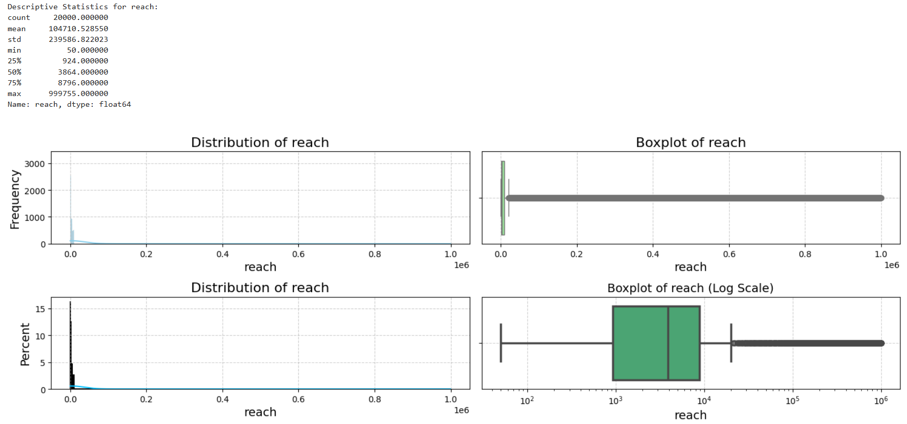

# DA Assignment 1

## Task Assignment

## Exploratory data analysis and data cleaning

### General data preprocessing

The following steps were preformed in order to investigate general data quality, 
structure and omit fully empty or duplicated rows from analysis.

#### Defined proper feature types:

Files loaded with provided `./data/bronze/group_data.csv` and `./data/bronze/posts_data.csv` were loaded with 
schemas defined below correspondingly.
```python
group_df_schema = {
    "post_id" : int,
    "group_name" : str
}

posts_df_schema = {
    "post_id" : int,
    "post_date" : object,  # parse_dates=["post_date"], date_format="%Y-%m-%d"
    "post_type" : str,
    "reach" : int,
    "click" : int,
    "likes" : float,
    "comments" : int,
    "share" : int,
    "reaction" : int
}
```

#### Removed empty rows and duplicated data:

No entirely empty or duplicated rows were found in both datasets.

#### Defined relation between two entities provided:

Column `post_id` is unique per row for each dataset and can be treated as PK for each table. 
Moreover, relation between two entities is one-to-one, therefore two datasets were joined on `post_id` into one
for further analysis.

#### Investigated number of empty values for each features:

Missing values were found only for feature `likes` (37 missing out of 20'000 total). 
After feature analysis they would be populated with proper values.

No other types of values that could be considered as "missing" we found, i.e. empty strings in 
categorical features, negative values, etc.

### Feature analysis

This section was dedicated to analyse features distribution, outliers presence, correlations.

#### Categorical features analysis:

There are only two categorical features for dataset: `post_type` and `group_name`. 
Each of them contains approximately same number of rows.


#### Numerical features analysis:

For numerical features following results were obtained.
- `reach`: no values missing, no negative values, logarithmic distribution, big number of outliers with high values.
- `click`: no values missing, no negative values, logarithmic distribution, big number of outliers with high values.
- `likes`: 37 values missing, no negative values, logarithmic distribution, bit number of outliers with high values.
- `comments`: no values missing, rows count for each comments number is the almost same, no outliers.
- `share`: no values missing, rows count for each share number is the almost same, no outliers.
- `reaction`: no values missing, rows count for each reaction number is the almost same, no outliers.

Graphics with statistics and distribution for each numerical features are provided below.



#### Numerical features correlations:

Pearson and Spearman correlation matrices, from which it could be seen that 
for `reach ~ likes` and `reach ~ clicks` exists a strong linear relationship.


By building pairwise scatter plots for features, we can conclude the following:
- Relationships `reach ~ likes` and `reach ~ clicks` are formed from multiple straight lines. Data obviously was generated,
  and these dependencies further will be used to populate missing values and prediction analysis.
- No other relations make sense in terms of prediction / trend / correlation value: data is distributed evenly. 


#### Numerical features analysis within groups:

- Within groups `post_type` and `group_name` all numerical features are distributed in the same way. 
- General statistic parameters within groups is equal.
- No conclusions regarding distinct behaviour of numerical features within group could be made.

### Empty values handling

#### Empty values populating:

Taking in consideration specific linear correlation (multiple lines in fact) `likes ~ reach`, 
the most reasonable approach of handling those empty values can be linear regression. 

In this case, missing `likes` would be on the "line in the middle".


### Outliers investigation

#### Features containing outliers:

From numerical feature analysis we can conclude, that outliers and any possible anomalies are in features 
`reach`, `likes` and `click`. Now we will take a look at total number and data of outliers per each feature.

```csv
Number of outliers in 'reach': 3967
Outliers statistics:
count      3967.000000
mean     514307.745652
std      282995.188409
min       20937.000000
25%      268513.500000
50%      516023.000000
75%      763542.500000
max      999755.000000
Name: reach, dtype: float64

Number of outliers in 'likes': 3573
Outliers statistics:
count     3573.000000
mean     28712.371397
std      22907.830673
min       1193.000000
25%       9577.000000
50%      22153.000000
75%      42930.000000
max      99869.000000
Name: likes, dtype: float64

Number of outliers in 'click': 3575
Outliers statistics:
count     3575.000000
mean     28392.148252
std      23005.056095
min       1193.000000
25%       9351.500000
50%      21465.000000
75%      41755.500000
max      99923.000000
Name: click, dtype: float64
```

#### Dependency between outliers investigation:

Most rows in 3 outliers dataset are the same, and it could be a thing, 
that outliers detected with IRQ are actually outstanding and the most popular posts within whole dataset. 
Therefore, we do not need to exclude those rows from further consideration as they are priceless examples 
of posts success.

On the other hand, it is interesting to look at rows, where only one or two considered features have 
extremely high values.

Rows, which were considered as outliers by IRQ for all 3 features, we will keep in the dataset, as they are "examples of post success", required for futher analysis.

Other cases are the following:
- **High `reach`, high `likes`, relatively small amount of `clicks`:** _those rows are indicating that something is wrong with data (we suppose that `clicks` presents a total amount of clicks on the post, including likes / comments / sharing functionality), and, therefore, they would be excluded from analysis._
- **High `reach`, relatively small amount of `likes`, high `clicks`:** _keeping these rows in analysis, as they could indicate that posts were seen buy big amount of users, but collected negative reactions._
- **High `reach`, small amount of `likes` and `clicks`:** _keeping these rows in analysis as posts, that were seen buy big amount of people, but did not force them to interact with this post._


## Feature Engineering and correlations investigation:
- `Feature_Engineering_and_Reccomendations.ipynb`

## Predictive analysis:
- `Reach_and_Likes_Prediction.ipynb`
